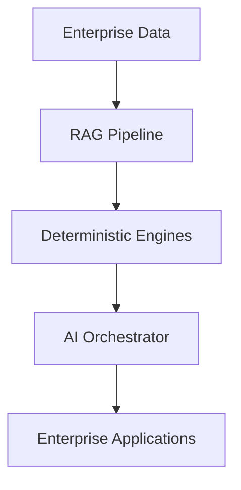
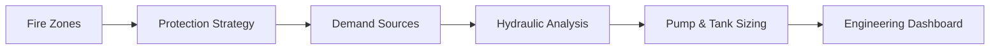

  

---

# 👨‍💼 About Me

<table>
<tr>
<td width="62%">

Strategic and delivery-focused Product Owner and Business Analyst with 17+ years of experience leading enterprise digital transformation, workflow automation, AI-enabled engineering systems, EHS platforms, PTW/ePTW solutions, and operational governance initiatives.

Experienced in designing scalable enterprise applications aligned with:
- workflow orchestration
- compliance and auditability
- engineering risk management
- operational governance
- AI-assisted transformation
- multi-system enterprise integration

Strong background translating complex operational, engineering, compliance, and business requirements into modern enterprise platforms that improve process standardisation, stakeholder collaboration, operational visibility, and decision-making efficiency.

</td>

<td width="38%">

</td>
</tr>
</table>

---

# 🚀 Enterprise Platform Portfolio

---

## 🤖 Siddhanta AI

<table>
<tr>
<td width="65%">

Deterministic-first Agentic AI platform designed for enterprise engineering and operational environments where AI narration is governed through validated engineering workflows and deterministic calculation systems.

### Platform Focus
- Deterministic AI orchestration
- Enterprise RAG architecture
- Engineering workflow intelligence
- AI governance & guardrails
- Knowledge ingestion framework
- Operational decision support systems
- Audit-compliant AI workflows

</td>

<td width="35%">

</td>
</tr>
</table>

---

## 🛡️ EHS & Permit to Work Platforms

<table>
<tr>
<td width="50%">

### Enterprise Modules
- Permit to Work (PTW/ePTW)
- Incident Management
- CAPA Management
- Audit & Compliance
- Risk Assessment
- LOTOTO & Isolation
- SIMOPS Coordination
- Toolbox Talk Systems
- PPE Workflow Management

</td>

<td width="50%">

### Business Objectives
- Operational Governance
- Workflow Automation
- Compliance Traceability
- Enterprise Reporting
- Audit Readiness
- Risk Visibility
- Process Standardisation
- Cross-Functional Coordination

</td>
</tr>
</table>

---

## 🌊 Hydraulic Demand System

Modern engineering platform supporting fire water demand analysis, hydraulic calculations, protection strategy management, and industrial firefighting system design.

### Platform Capabilities

| Engineering Systems | Analysis & Operations |
|---|---|
| Fire Zone Management | Hydraulic Calculations |
| Protection Strategy | Pressure Loss Analysis |
| Demand Source Analysis | Scenario Modelling |
| Pump & Tank Sizing | Design Criteria Validation |
| Engineering Workflows | Enterprise Dashboards |

---

## ⚠️ DORA Tool (DNV-RP-F107)

Enterprise-grade Dropped Object Risk Assessment platform supporting deterministic engineering calculations, subsea risk analysis, ALARP evaluation, and spatial impact modelling.

| Risk Analysis | Engineering Modelling | Enterprise Features |
|---|---|---|
| Impact Energy | Ring Band Modelling | KPI Dashboards |
| Release Frequency | Geospatial Mapping | Audit Traceability |
| Damage Frequency | Barrier Analysis | Risk Heatmaps |
| ALARP Evaluation | Probability Distribution | Workflow Governance |

---

# 🧩 Core Competencies

| 🚀 Product & Delivery | 🧠 AI & Transformation | ⚙️ Enterprise Systems |
|---|---|---|
| Product Ownership | AI Strategy | Engineering Platforms |
| Agile & Scrum Delivery | Agentic AI Systems | EHS & PTW Systems |
| Backlog Prioritisation | Deterministic AI | Risk Assessment Platforms |
| Stakeholder Management | RAG Architecture | Operational Governance |
| Requirements Engineering | Workflow Automation | Enterprise SaaS Solutions |
| BPMN Workflow Design | AI Governance | Multi-System Integration |

---

# 🛠️ Technology Ecosystem

---

# 📊 Enterprise Capability Matrix

| Capability Area | Enterprise Experience |
|---|---|
| Product Ownership & Agile Delivery | ████████████████████ |
| Business Analysis & Transformation | ████████████████████ |
| Digital Transformation Strategy | ███████████████████ |
| AI & Workflow Automation | ██████████████████ |
| Engineering Platform Solutions | ██████████████████ |
| EHS & PTW Systems | ███████████████████ |
| Enterprise Architecture | ██████████████████ |
| Operational Governance Platforms | ███████████████████ |

---

# 🏅 Certifications

| Certification | Provider |
|---|---|
| Professional Scrum Product Owner™ I (PSPO I) | Scrum.org |
| Professional Scrum Product Owner™ – AI Essentials (PSPO AIE) | Scrum.org |
| Certified Scrum Master (CSM) | Scrum Alliance |
| Project Management Essentials Certified (PMEC) | Management & Strategy Institute |

---

# 🌐 Connect With Me

---

## 💡 Building enterprise-grade AI and engineering platforms that combine deterministic accuracy, operational governance, workflow intelligence, and scalable digital transformation.

  

