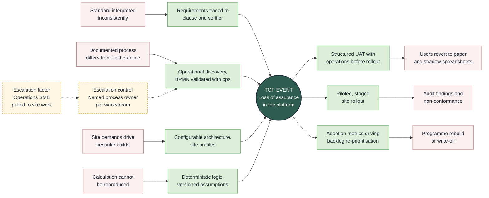

<!--
  ============================================================
  Prakaash Khaire — GitHub Profile README
  Banner and footer are self-hosted in ./assets — no external image services
  ============================================================
-->

<b>Enterprise Transformation</b> &nbsp;·&nbsp; <b>AI &amp; Engineering Systems</b> &nbsp;·&nbsp; <b>Workflow Automation</b> &nbsp;·&nbsp; <b>Operational Governance</b>

17+ years delivering compliance-driven platforms across industrial and enterprise environments

  

  

---

## 👋 About Me

> Strategic and delivery-focused Product Owner and Business Analyst with **17+ years** of experience delivering enterprise digital transformation, workflow automation, compliance-driven platform solutions, and AI-enabled operational systems across industrial, enterprise, and technology environments.

**Experienced in leading**

`Enterprise Workflow Transformation` &nbsp;`Operational Governance Systems` &nbsp;`EHS & PTW/ePTW Platforms` &nbsp;`Engineering Risk Assessment Solutions`

`AI-Assisted Enterprise Systems` &nbsp;`Digital Process Modernisation` &nbsp;`Configurable Workflow Architecture` &nbsp;`Enterprise Integration Initiatives`

Strong expertise in translating complex operational, compliance, engineering, and business requirements into scalable enterprise platforms aligned with governance, auditability, automation, stakeholder collaboration, and strategic transformation objectives.

 

## 🔗 Delivery Assurance Model

Applying bow-tie methodology to delivery itself. **Hazard:** safety-critical operations governed by software. **Top event:** loss of assurance in the delivered platform — the point at which the system can no longer be trusted to reflect operational reality.

<b>Threats</b> → <b>preventive barriers</b> → <b>top event</b> → <b>recovery barriers</b> → <b>consequences</b>, with escalation factors degrading a barrier. Rendered natively by GitHub.

 

## 🚀 Enterprise Platform Portfolio

<b>🛡️ &nbsp;EHS &amp; Permit to Work Platforms</b>

 

Enterprise operational governance solutions supporting workflow automation, safety management, compliance visibility, and digital operational transformation.

| Safety &amp; Compliance | Operational Control | Governance Systems | Workflow Automation |
|:---|:---|:---|:---|
| Permit to Work (PTW/ePTW) | LOTOTO Management | Audit &amp; Compliance | Workflow Automation |
| Incident Management | SIMOPS Coordination | CAPA Management | Operational Reporting |
| Risk Assessment | Toolbox Talk Systems | PPE Management | Compliance Traceability |

<b>⚠️ &nbsp;DORA Tool (DNV-RP-F107)</b>

 

Enterprise engineering platform supporting dropped object risk assessment, deterministic impact analysis, subsea pipeline protection evaluation, and operational risk governance aligned with DNV-RP-F107.

| Risk Assessment | Engineering Analysis | Spatial &amp; Impact Modelling | Enterprise Operations |
|:---|:---|:---|:---|
| Dropped Object Register | Impact Energy Calculations | Ring Band Modelling | KPI Dashboards |
| Release Frequency Analysis | Damage Frequency Assessment | Geospatial Mapping | Workflow Automation |
| Barrier Effectiveness | ALARP Risk Evaluation | Probability Distribution | Operational Governance |
| Bow-Tie Risk Analysis | Escalation Modelling | Subsea Layout Mapping | Audit Traceability |
| Risk Matrix Configuration | Consequence Assessment | Pipeline Exposure Analysis | Compliance Reporting |

<b>🌊 &nbsp;Hydraulic Demand System</b>

 

Enterprise engineering platform supporting fire water demand analysis, hydraulic calculations, protection strategy management, and industrial firefighting system design.

| Fire Protection | Hydraulic Analysis | Engineering Design | Enterprise Operations |
|:---|:---|:---|:---|
| Fire Zone Management | Hydraulic Calculations | Pump &amp; Tank Sizing | Engineering Dashboards |
| Protection Strategy | Pressure Loss Analysis | Design Criteria Validation | Workflow Automation |
| Fire Case Definition | Demand Source Analysis | Scenario Modelling | Operational Governance |

 

## 🧩 Core Competencies

| 🚀 Product &amp; Delivery | 🧠 AI &amp; Transformation | ⚙️ Enterprise Systems |
|:---|:---|:---|
| Product Ownership | AI Strategy | Engineering Platforms |
| Agile &amp; Scrum Delivery | Agentic AI Systems | EHS &amp; PTW Systems |
| Backlog Prioritisation | Deterministic AI | Risk Assessment Platforms |
| Stakeholder Management | Workflow Automation | Operational Governance |
| Requirements Engineering | Enterprise AI Integration | Enterprise SaaS Solutions |
| BPMN Workflow Design | RAG Architecture | Multi-System Integration |

 

## 🛠️ Technology Ecosystem

 

## 🏅 Certifications

| Certification | Provider |
|:---|:---|
| Professional Scrum Product Owner™ – AI Essentials (PSPO AIE) | Scrum.org |
| Professional Scrum Product Owner™ I (PSPO I) | Scrum.org |
| Certified Scrum Master (CSM) | Scrum Alliance |

 

---

### 🌿 Building enterprise-grade AI and operational platforms

Combining deterministic accuracy, workflow intelligence, governance, automation, and scalable digital transformation.

 

