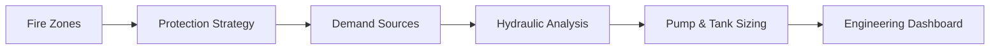

  

---

# 👋 About Me

Strategic and delivery-focused Product Owner and Business Analyst with 17+ years of experience delivering enterprise digital transformation, workflow automation, compliance-driven platform solutions, and AI-enabled operational systems across industrial, enterprise, and technology environments.

Experienced in leading:
- enterprise workflow transformation
- operational governance systems
- EHS & PTW/ePTW platforms
- engineering risk assessment solutions
- AI-assisted enterprise systems
- digital process modernisation
- configurable workflow architecture
- enterprise integration initiatives

Strong expertise in translating complex operational, compliance, engineering, and business requirements into scalable enterprise platforms aligned with governance, auditability, automation, stakeholder collaboration, and strategic transformation objectives.

---

# 🚀 Enterprise Platform Portfolio

## 🤖 Siddhanta AI

Deterministic-first Agentic AI platform designed for enterprise engineering and operational environments where AI orchestration is governed through validated engineering calculations, workflow intelligence, and operational governance principles.

### Platform Focus
- Deterministic AI Systems
- Enterprise RAG Architecture
- AI Governance & Guardrails
- Workflow Intelligence
- Engineering Decision Support
- Enterprise Knowledge Systems
- Operational AI Automation

## ⚠️ DORA Tool (DNV-RP-F107)

Enterprise-grade Dropped Object Risk Assessment platform supporting deterministic engineering calculations, ALARP evaluation, spatial impact modelling, and operational risk governance.

### Platform Capabilities

| Risk Analysis | Engineering Modelling | Enterprise Features |
|---|---|---|
| Impact Energy | Ring Band Modelling | KPI Dashboards |
| Release Frequency | Geospatial Mapping | Audit Traceability |
| Damage Frequency | Barrier Analysis | Workflow Governance |
| ALARP Evaluation | Probability Distribution | Risk Heatmaps |

---

## 🌊 Hydraulic Demand System

Enterprise engineering platform supporting fire water demand analysis, hydraulic calculations, protection strategy management, and industrial firefighting system design.

### Engineering Modules
- Fire Zone Management
- Protection Strategy
- Demand Source Analysis
- Hydraulic Calculations
- Pump & Tank Sizing
- Pressure Loss Analysis
- Scenario Modelling
- Engineering Dashboards

---

## 🛡️ EHS & Permit to Work Platforms

Enterprise operational governance solutions supporting workflow automation, safety management, compliance visibility, and digital operational transformation.

### Functional Areas
- Permit to Work (PTW/ePTW)
- Incident & Investigation Management
- CAPA Management
- Audit & Compliance Systems
- Risk Assessment Workflows
- LOTOTO & Isolation Management
- SIMOPS Coordination
- Toolbox Talk Management
- PPE Workflow Automation

---

# 🧩 Core Competencies

| 🚀 Product & Delivery | 🧠 AI & Transformation | ⚙️ Enterprise Systems |
|---|---|---|
| Product Ownership | AI Strategy | Engineering Platforms |
| Agile & Scrum Delivery | Agentic AI Systems | EHS & PTW Systems |
| Backlog Prioritisation | Deterministic AI | Risk Assessment Platforms |
| Stakeholder Management | Workflow Automation | Operational Governance |
| Requirements Engineering | Enterprise AI Integration | Enterprise SaaS Solutions |
| BPMN Workflow Design | RAG Architecture | Multi-System Integration |

---

# 🛠️ Technology Ecosystem

---

# 📊 Enterprise Capability Matrix

| Capability Area | Enterprise Experience |
|---|---|
| Product Ownership & Agile Delivery | ████████████████████ |
| Business Analysis & Transformation | ████████████████████ |
| Digital Transformation Strategy | ███████████████████ |
| Workflow Automation Systems | ███████████████████ |
| AI & Engineering Platforms | ██████████████████ |
| EHS & Operational Governance | ███████████████████ |
| Enterprise Architecture | ██████████████████ |
| Stakeholder & Programme Delivery | ███████████████████ |

---

# 🏅 Certifications

| Certification | Provider |
|---|---|
| Professional Scrum Product Owner™ – AI Essentials (PSPO AIE) | Scrum.org |
| Professional Scrum Product Owner™ I (PSPO I) | Scrum.org |
| Certified Scrum Master (CSM) | Scrum Alliance |

---

# 🌐 Connect With Me

---

## 💡 Building enterprise-grade AI and operational platforms that combine deterministic accuracy, workflow intelligence, governance, automation, and scalable digital transformation.

  

